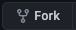
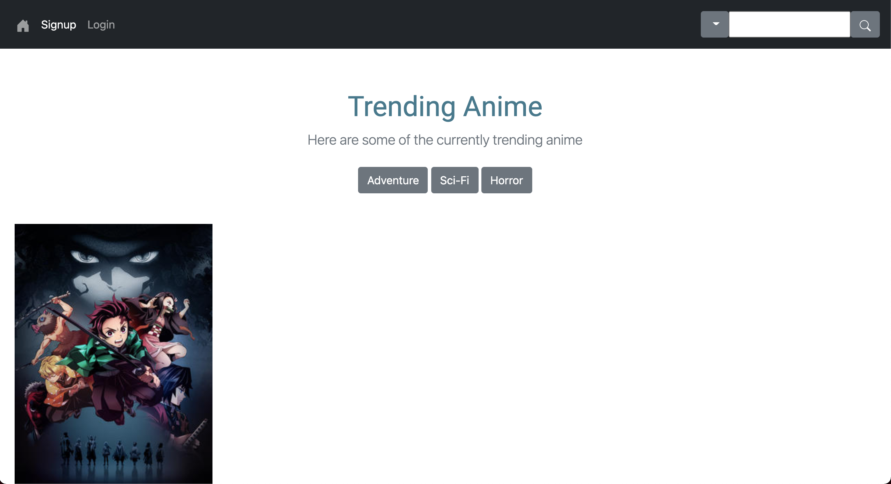
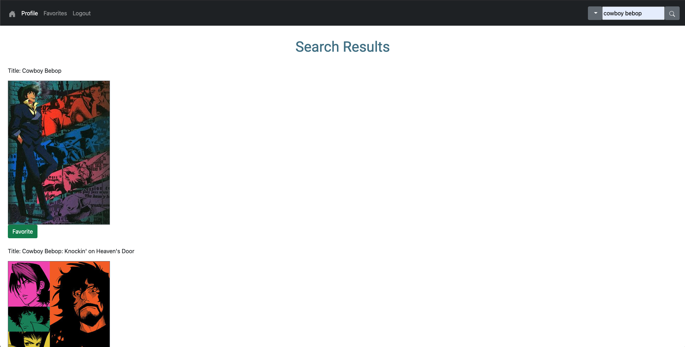
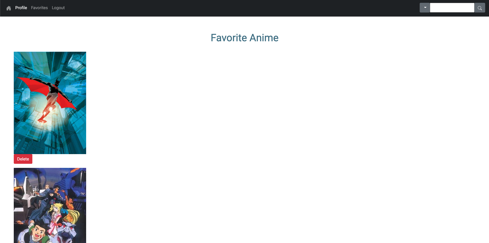

# ANIME DATABASE

## Introductions

Anime-DB is an anime search engine that allows users to search for their favorite anime movies or tv shows. Furthermore, users are able to create an account that will allow them to save their favorite shows or movies and share it with their friends or family. However, you will need to create a user account before being able to do just that!

You can navigate to the [live site](https://anime-db.herokuapp.com/) or check out the [Github reposity](https://github.com/noncenze/Anime_DB) to see it in action. Thanks for looking!

## Installation and Usage (from Github)

1. Navigate to the [Github](https://github.com/noncenze/Anime_DB) reposity
2.  the reposity
3. Locate the  and copy the provided `URL`
4. Open a command line or terminal and navigate to a directory where the files will be cloned
5. Make a copy to the local machine with the `git clone` command in the terminal:
```
git clone https://github.com/noncenze/Anime_DB.git
```
6. Navigate into the folder and run the `npm-install` command:
```
npm i
```
7. Run the program with `npm start` command:
```
npm start
```

## Things you can do with this app

- With an account
    * Search for your favorite anime movie or tv shows
    * Save your favorite titles
    * View additional details on your selected titles

- Without an account
    * Search for your favorite anime movie or tv shows
    * View-only images

- Update account information
    * Change your name or email address


## Main Page

The main home page where users will presented with some of the most trending animes being currently watched.



## Search Page

Displays a list of the current search results.



## Favorites Page

Displays a list of the user's currently favorited anime movies or tv shows.



<br/>

# UNDER THE HOOD

## Technologies Used

Main Technology
* JavaScript
* HTML
* CSS

Dependencies
* Node.js
* Express
* Postgres
* Sequelize
* Axios
* Bootstrap
* Passport


## Navigation Routing

The table below breakdowns the routing used that allow users to navigate between pages.

VERB| URL                   | ACTION        | Description
--- | ---                   | ---           | ---
GET | /                     | Index (Read)  |   Main page
GET | /auth/login           | Login (Read)  |   Log-in display
GET | /auth/signup          | Signup (Read) |   Displays the current user's account
GET | /auth/logout          | Logout (Read) |   Logs out the current account
POST| /auth/login           | Login (Create)|   Allows users to login to a existing account
POST| /auth/signup          | Signup (Create)|   Allows user to create an account
GET | /anime/:id            | Display (Read)|   Displays the search results
GET | /anime/details/:id    | Display (Read)|   Displays additional details on a specific anime
GET | /anime/favorites      | Display (Read)|   Displays an account's favorites anime
GET | /profile              | Display (Read)|   Displays the current user's account informtion
PUT | /edit/:profile        | Update (update)|  Allows user's to update their profile information

## View Routing

Anime-DB uses JavaScript along with the Express and EJS framework to render HTML views to allow users to navigate between pages. <br/>
The following table breakdowns the basic structure of how views are organized.

```
Main -- - Index         Home page where users are redirected are logging in
|      |- Profile       Displays a user's account information
|      |- Edit          Allows a user to edit their account information
|
|
⊢ auth -- - signup      Allows a user to create an account
|        | - login      Allows a user to log in with an existing account
|        | - edit       Allows a user to edit their account information
|
|
⊢ anime -- - results    Displays the search results
          | - details   Displays additional information about a specific title
          | - favorites Displays a list of currently favorited shows/movies
```


## Favorites Functionality

This is the core functionality of the app that allows users to save their favorite search results. This is done by searching through the database to either: finding an existing entry within the database and associating with the user or creating a new entry if one doesn't exist and associating it with the current user. This had to be done in a nested `.then()` function since the API had troubles associating it with any other methods attemped.

```js
// FAVORITES FUNCTIONALITY - adds animes to users favorites list
router.post('/favorites', isLoggedIn, (req, res) => {
    db.user.findOne({where: {id: req.user.id}})
    .then(foundUser => {
        db.anime.findOne({where: {uniqueId: req.body.uniqueId}})
        .then(foundAnime => {
            if (foundAnime) {
                foundUser.addAnime(foundAnime)
                .then(() => {
                    res.redirect('/anime/favorites');
                }).catch(error => {
                    console.log(error);
                })
            } else {
                db.anime.create({
                    uniqueId: req.body.uniqueId,
                    title: req.body.animeTitle,
                    image: req.body.animeImage
                }).then(createdAnime => {
                    foundUser.addAnime(createdAnime)
                    .then(() => {
                        res.redirect('/anime/favorites');
                    }).catch(error => {
                        console.log('----------------- ERROR -----------------');
                        console.log(error);
                    })
                }).catch(error => {
                    console.log('----------------- ERROR -----------------');
                    console.log(error);
                })
            }
        }).catch(error => {
            console.log('----------------- ERROR -----------------');
            console.log(error);
        })
    }).catch(error => {
        console.log('----------------- ERROR -----------------');
        console.log(error);
    })
});
```

## Future Considerations

Some considerations include:
1. Improved search functionality
    * Allow users to search with different parameters (i.e. categories, characters, genre, etc.)
    * Allow users to favorite from the results page without being redirected
    * Display different categories on the main page
    * Allow for different sorting functionality
    * Streamline some of the views
2. Surprise/random functionality
    * Create a 'surprise/random' functionality to allow for anime discovery
3. Styling updates
    * Incorporate interactive functionality
    * Style the pages with consistent styling

## Resources

API Used: [Kitsu API](https://kitsu.docs.apiary.io/)

People: My amazing pod of 'Elite Coders'!