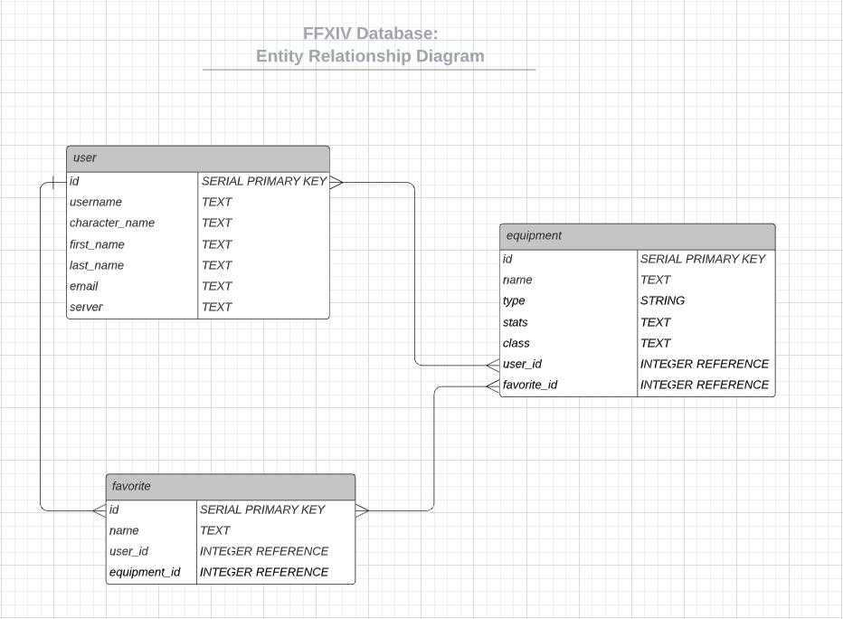

# Proposal

`1` An application name / concept

* Final Fantasy XIV Equipment Database: An equipment database that pulls and displays information on the various equipment used in Final Fantasy XIV, the popular online MMORPG based in the Final Fantasy universe.

`2` A repo for your project 2 (built from express_auth template)

* Project Repo: https://github.com/noncenze/Project_2

`3` Wireframe for your app - (Lucidchart)

Will update once I figure out how I want it to look

`4` An ERD with two models (minimum) > User + 1 Resource (one to many) - (Lucidchart)

* ER Diagram

`5` Create (3-5) User Stories for the base user experience - ( [Reference](https://revelry.co/resources/development/user-stories-that-dont-suck/) )

* As a video-game player, I want a clean and concise database so that I can quickly look-up information and details on certain aspects of the game when I'm playing.

* As a casual player, I want to be able to see be able to see what my friends and teammates are up so that I can stay connected without actually having to login to the game. 

* As a hardcore player, I want to be able to track my combat records so that I can compare how well I am performing against certain contents of the game compared to other players within my ranking.

`6` Resource's Restful Routing table ( [Readme](https://romebell.gitbook.io/sei-412/node-express/00readme-1/01intro-to-express/00readme#restful-routing) )

VERB | URL | ACTION | Description
--- | --- | --- | ---
GET | /equipment | Index | list all equipment
GET | /equipment/:id | Show | list all information about a specific piece of equipment
PUT | /equipment/:id | Update | allow users to update a specific piece of equipment
GET | /equipment/favorites | Show | shows a list of favorited equipment

`7` Find API and test to see if you can get data ( *be able to print data in the console using Axios, Node-Fetch, and/or Postman* )

Will update once I have information back from the API