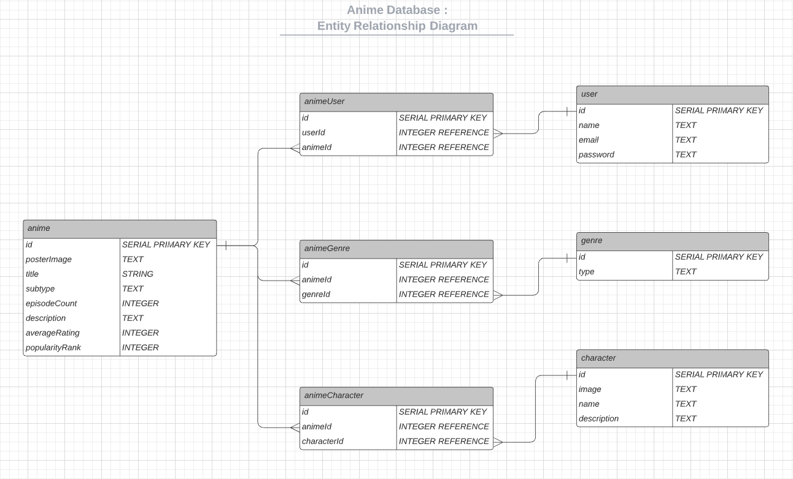
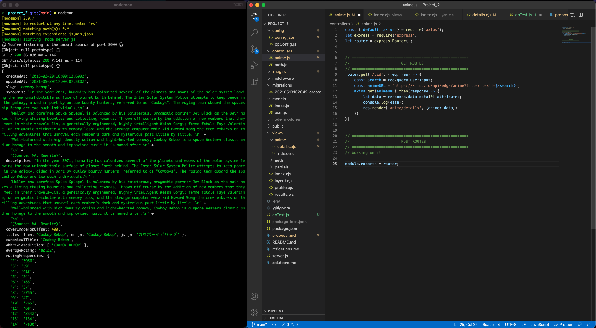

# Proposal

`1` An application name / concept

* <strong>Anime Database</strong>: An anime database

`2` A repo for your project 2 (built from express_auth template)

* Project Repo: https://github.com/noncenze/Project_2

`3` Wireframe for your app - (Lucidchart)

Will update once I figure out how I want it to look

`4` An ERD with two models (minimum) > User + 1 Resource (one to many) - (Lucidchart)

* Anime ER Diagram

`5` Create (3-5) User Stories for the base user experience - ( [Reference](https://revelry.co/resources/development/user-stories-that-dont-suck/) )

* Will need to redo these

`6` Resource's Restful Routing table ( [Readme](https://romebell.gitbook.io/sei-412/node-express/00readme-1/01intro-to-express/00readme#restful-routing) )

VERB| URL                   | ACTION        | Description
--- | ---                   | ---           | ---
GET | /                     | Index (Read)  |   Main page
GET | /auth/login           | Login (Read)  |   Log-in display
GET | /auth/signup          | Signup (Read) |   Displays the current user's account
GET | /auth/logout          | Logout (Read) |   Logs out the current account
POST| /auth/login           | Login (Create)|   Allows users to login to a existing account
POST| /auth/signup          | Signup (Create)|   Allows user to create an account
GET | /anime/:id            | Display (Read)|   Displays the search results
GET | /anime/details/:id    | Display (Read)|   Displays additional details on a specific anime
GET | /anime/favorites      | Display (Read)|   Displays an account's favorites anime

 

`7` Find API and test to see if you can get data ( *be able to print data in the console using Axios, Node-Fetch, and/or Postman* )

Kitsu Anime Discovery API: https://kitsu.docs.apiary.io/#reference/users/users

Receiving data back from the API

